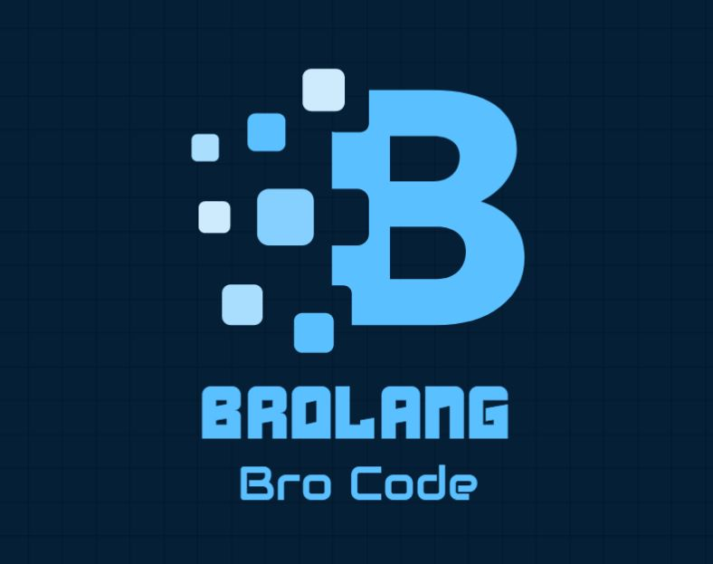

# BroLang


## Data Types

1. num: A data type that stores all the integer and float point values

2. String: A data type used to store text-based data, such as names, addresses, messages, and more. (basically int)

3. boolean: There are two values of the Boolean data type: Cap and NoCap, which represent "false" and "true" statements, respectively.

## Arithmetic Operations

1.  \+ : This represents addition operation (2+5=7)
2.  \- : This represents subtraction operation (2-5=-3)
3.  \* : This represents multiplication operation (2*5 = 10)
4.  /  : This represents division operation (2/5 = 0.4)

## Assignment Operator

1. := (this represents the equal to operation (num i := 5))

## String Operations

1. watchaPackin: <string> (returns the number of character in the string, i.e its length)
2. <string>[m:*] (returns the substring from index m to end)
3. <string>[m:n] (returns the substring from index m to index n - 1)
4. <string>[m] (returns the character at index m)
5. <string1> <index> <string2> (returns the index of string2 in string1)
	
## Example
	
```
string name := "pritam"
string substr
substr := name[0:3]
goOffKing substr
num len
len := watchaPackin: substr
goOff "Length is: "
goOff len
```
	
Output:
pri
Length is: 3

## Display Operations

1. goOff (prints the string/ number / boolean to the console)
2. goOffKing (prints the string/ number / boolean to the console along with a new line)
3. getSauce (takes input from the user; there are three type specifiers: %n, %b, and %s for numbers, booleans, and strings respectively)

## Example

Input: hey 
	
```
goOff "Hello World!"
string name
getSauce %s name
goOff name
```
	
Output:
Hello World!
<User input>: Pritam
Pritam

Iterative Statements

1. loopin i : (initial,final)   (for loop - intitial to final)  
A loop which executes the code, written in the block, (final-initial) times

Example: 

```
num m := 0
num n := 3
loopin i : (m,n)
{
	goOff i
}
```

2. tillClapback(<condition>)   (while)
A loop which executes the code, written in the block, till the [condition] becomes Cap.

Example :

```
num i := 5
tillClapback(i > 0)
{
	goOff i
	i := i - 1
}
```
	
3. vibeCheck(<condition>)  (If): executes the code if the [condition] is NoCap.

4. bruhPlease(<condition>) (else if ): the "else-if" equivalent

5. okBoomer (else): the "else" equivalent

6. peaceOut:
End if statement
Ends the if loop.

Example:

```
num i := 5
vibeCheck(i == 1)
{
	goOff i
}
bruhPlease(i == 3)
{
	goOff i 
}
okBoomer
{
	goOff i
}
peaceOut
```
